# Teknologi Komputasi Awan

## Anggota Kelompok

| NRP | Nama |
|-----|------|
| 5027241045 | Ivan Syarifuddin |
| 5027241053 | Oscaryavat Viryavan |
| 5027241056 | Theodorus Aaron Ugraha |
| 5027241057 | Ananda Fitri Wibowo |
| 5027241075 | Muhammad Farrel Rafli Al Fasya |
| 5027241091 | Muhammad Ardiansyah Tri Wibowo |
| 5027241106 | Mohammad Abyan Ranuaji |
| 5027241109 | Raynard Carlent |

---

## Daftar Isi

1. [Introduction](#1-introduction)
2. [Arsitektur Cloud](#2-arsitektur-cloud)
   * [Diagram Topologi](#diagram-topologi)
   * [Spesifikasi dan Estimasi Harga VM](#spesifikasi-dan-estimasi-harga-vm)
3. [Implementasi](#3-implementasi)
   * [Konfigurasi Database Server (VM 4)](#konfigurasi-database-server-vm-4)
   * [Konfigurasi Application Server (VM 2 dan VM 3)](#konfigurasi-application-server-vm-2-dan-vm-3)
   * [Konfigurasi Web Server dan Load Balancer (VM 1)](#konfigurasi-web-server-dan-load-balancer-vm-1)
4. [Hasil Pengujian Endpoint](#4-hasil-pengujian-endpoint)
   * [Pengujian API via Postman](#pengujian-api-via-postman)
   * [Tampilan Antarmuka Frontend](#tampilan-antarmuka-frontend)
5. [Hasil Load Testing](#5-hasil-load-testing)
   * [Analisis Strategi Load Balancing](#analisis-strategi-load-balancing)
   * [Pencarian Peak Concurrency (Skenario 2 hingga 5)](#pencarian-peak-concurrency-skenario-2-hingga-5)
6. [Kesimpulan dan Saran](#6-kesimpulan-dan-saran)

---

## 1. Introduction

Laporan ini disusun untuk memenuhi tugas Final Project mata kuliah Teknologi Komputasi Awan. Permasalahan utama yang diangkat adalah kebutuhan untuk mendeploy aplikasi Order Processing Service yang bersifat *write-heavy* ke lingkungan *production* di *cloud*. Aplikasi ini harus mampu menangani lonjakan beban *request* yang tinggi dari pengguna secara bersamaan tanpa mengalami kegagalan sistem.

Tujuan dari proyek ini adalah merancang dan mengimplementasikan arsitektur *cloud* terdistribusi (High Availability) yang mencakup lapisan Web Server, Load Balancer, Application Server, dan Database Server. Evaluasi dilakukan melalui serangkaian *load testing* eksternal untuk menentukan konfigurasi terbaik dan mengetahui batas maksimal kemampuan sistem dalam menangani lalu lintas pengguna yang simultan.

Dalam aplikasi ini, terdapat 4 endpoint utama, seperti berikut:

| Method | Endpoint | Deskripsi |
|--------|----------|-----------|
| POST | `/order` | Membuat pesanan baru |
| GET | `/order/<order_id>` | Mengambil detail & status pesanan |
| GET | `/orders` | Mengambil seluruh riwayat pesanan |
| PUT | `/order/<order_id>` | Mengubah status pesanan |
---

## 2. Arsitektur Cloud

### Diagram Topologi

Kelompok kami mengimplementasikan arsitektur *3-tier* terdistribusi di lingkungan *cloud*. Nginx digunakan sebagai *web server* sekaligus *load balancer* (gerbang utama) yang membagi beban lalu lintas ke dua *application server* Flask. Kedua *application server* tersebut kemudian berkomunikasi dengan satu database server MongoDB terpusat.

Berikut adalah diagram diagram topologi rancangan kami:


Diagram di atas menunjukkan aliran data dari Internet (melalui port 80 ke Nginx), diteruskan ke Application Tier (melalui port 5000), dan akhirnya berinteraksi dengan Database Tier (melalui port 27017).

### Spesifikasi dan Estimasi Harga VM

Untuk implementasi ini, kami menggunakan empat Virtual Machine (VM) dari penyedia layanan cloud *Digital Ocean* , dengan rincian spesifikasi dan estimasi harga sebagai berikut:

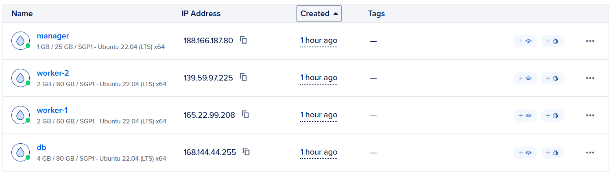

| Peran VM | Nama VM | Spesifikasi (vCPU/RAM) | Estimasi Harga/Bulan (Per VM) | Total Harga (Lapis) |
| :--- | :--- | :--- | :--- | :--- |
| Web & Load Balancer | manager | 1 vCPU, 1 GB RAM | $6 | $6 |
| Application Server | worker-1, worker-2 | 2 vCPU, 2 GB RAM | $18 | $36 |
| Database Server | db | 2 vCPU, 4 GB RAM | $24 | $24 |
| **Total** | | | | **$66** |

---

## 3. Implementasi

## 3.1 Konfigurasi VM

Pertama-tama, setup semua VM dengan docker (manager, worker, dan db):

```bash
sudo apt update && sudo apt upgrade -y

curl -fsSL https://get.docker.com | sh
sudo usermod -aG docker $USER
newgrp docker  

docker -v
docker compose version
```

## 3.2 Setup MongoDB (VM db)

1.  VM 4 dikonfigurasi untuk menjalankan MongoDB Server. Port 27017 dibuka pada *network security group* agar dapat diakses oleh VM Application Server.
2.  Data awal di-*restore* menggunakan *script* `generate_dump.py` atau `mongorestore` dari folder `resources/DB/dump`.
3.  Tangkapan layar di bawah menunjukkan proses pembersihan database menggunakan *script* `cleanup.sh` yang dijalankan dari jarak jauh untuk memastikan validitas pengujian beban.

```bash
mkdir -p ~/db && cd ~/db
mkdir dump
```

Setelah itu, copy file `docker-compose.yml` ke dalam folder tersebut, lalu:

```bash
docker compose up -d

docker cp ./dump mongodb:/dump
docker exec -it mongodb mongorestore /dump

docker exec -it mongodb mongosh --eval "db.adminCommand('ping')"
```

Output:

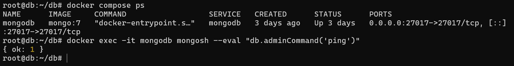

## 3.3 Setup backend Flask + Gunicorn (VM worker 1 & 2)

1.  VM 2 dan VM 3 menjalankan aplikasi Flask. Dependensi diinstal menggunakan `pip install -r resources/BE/requirements.txt`.
2.  Aplikasi dijalankan menggunakan Gunicorn sebagai WSGI *server* dengan konfigurasi 9 *workers* (`-w 9 -b 0.0.0.0:5000`) untuk memaksimalkan penggunaan vCPU yang tersedia.
3.  Variabel lingkungan dikonfigurasi agar aplikasi terhubung ke IP VM 4 (Database).
4.  Berikut adalah tampilan `htop` pada VM Backend 1 (VM 2) yang menunjukkan beban kerja proses Python/Gunicorn saat menahan beban tinggi.

Pastikan `app.py` sudah ada di tiap VM backend, dengan file `docker-compose.yml`, `requirements.txt` dan `Dockerfile` dari github ini

Jalankan dengan command berikut:

```bash
mkdir backend
cd ~/backend
docker compose up -d --build

docker compose ps
curl http://localhost:5001/orders
curl http://localhost:5002/orders
```


Output:

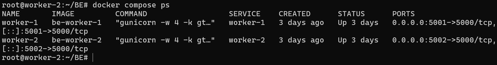

## 3.4 Setup manager (VM 1)

1. Untuk managernya, kelompok kami menggunakan sebuah web server dan reverse proxy open source berbasis bahasa `GO` bernama `Caddy`. Kami menggunakan Caddy karena memiliki konfigurasi yang ringkas, serta integrasi yang sangat mudah dengan sistem cloud dan sistem container.
2. Setelah itu, masukkan file frontend dari folder resource yaitu `index.html` dan `styles.css` ke dalam manager.
3. Untuk observasi selama load testing dan demo, Dozzle memberikan visual log stream yang cukup informatif tanpa menambah beban operasional atau cost.


**Validasi Caddyfile:**

```bash
docker run --rm -v $(pwd)/Caddyfile:/etc/caddy/Caddyfile caddy:2-alpine caddy validate --config /etc/caddy/Caddyfile

# Dan Jalankan
docker compose up -d
```

Output:

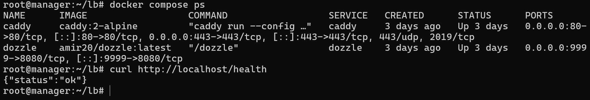

### Konfigurasi Caddy dan Dozzle:

Dalam file `docker-compose.yml`, ada 2 service yang dijalankan seperti berikut:

```yaml
services:
  caddy:
    image: caddy:2-alpine
    container_name: caddy
    restart: unless-stopped
    ports:
      - "80:80"
      - "443:443"
    volumes:
      - ./Caddyfile:/etc/caddy/Caddyfile
      - ./frontend:/srv/frontend
      - caddy_data:/data
      - caddy_config:/config

  dozzle:
    image: amir20/dozzle:latest
    container_name: dozzle
    restart: unless-stopped
    ports:
      - "9999:8080"
    volumes:
      - /var/run/docker.sock:/var/run/docker.sock:ro
    environment:
      - DOZZLE_NO_ANALYTICS=true

volumes:
  caddy_data:
  caddy_config:
```

Berdasarkan kode diatas, saya menggunakan Caddy untuk menerima traffic dan Dozzle untuk menampilkan grafik hasil traffic terima dari Caddy.

Dashboard Dozzle ada pada port `:9999`:

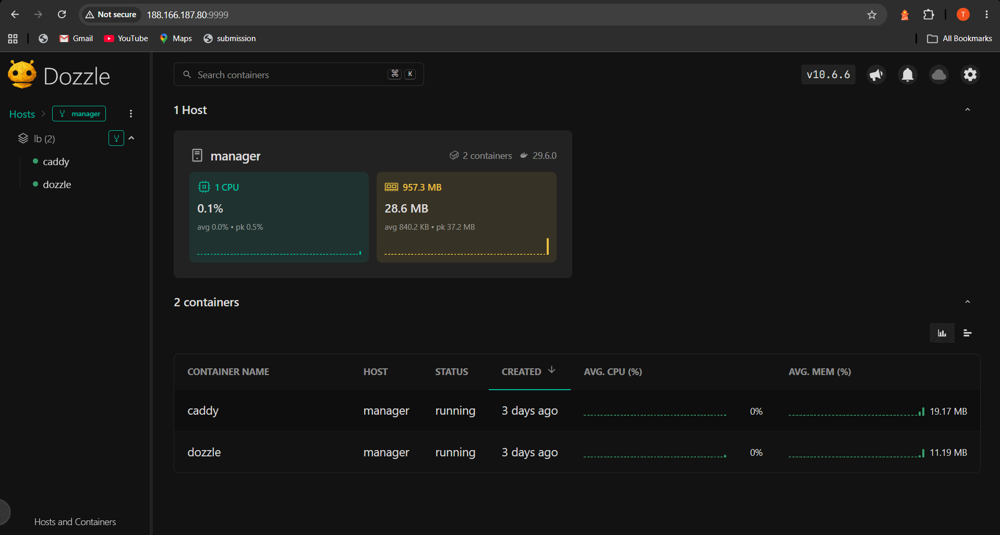

## 3.5 Verifikasi Frontend

Masuk ke dalam browser dan buka `http://<IP_MANAGER>/` untuk melihat frontend dari sistem e-commerce. Lalu cek endpoint dari frontend apakah tersambung dengan backend:

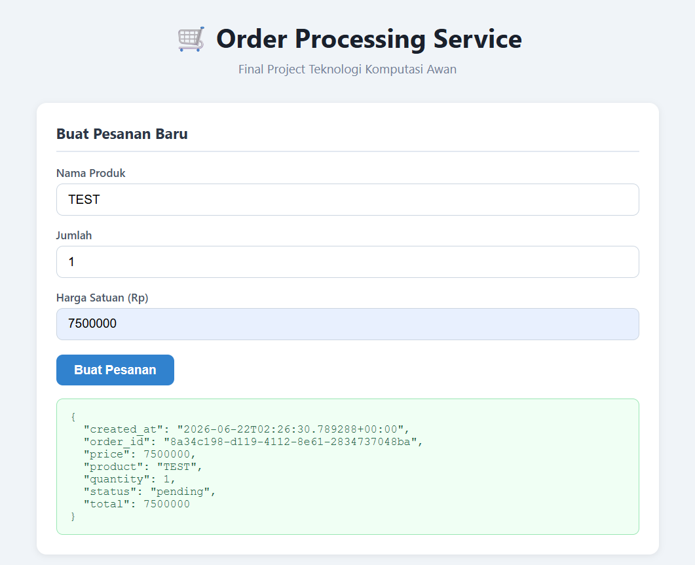
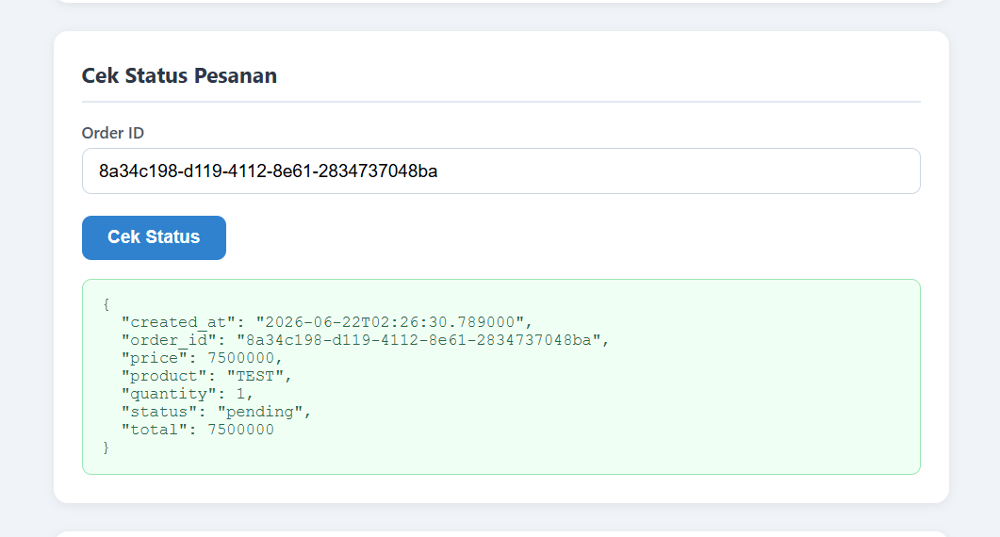
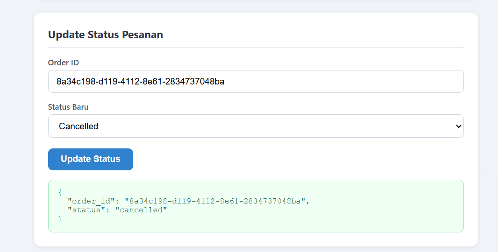
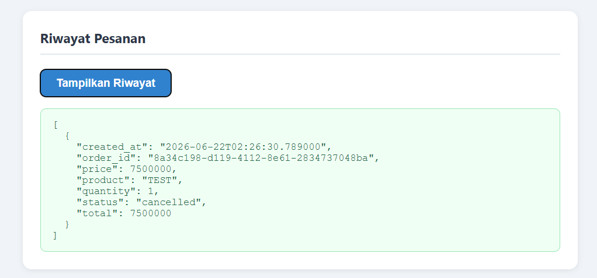

---

## 4. Hasil Pengujian Endpoint

### Pengujian API via Postman

Kami menguji keempat *endpoint* API utama menggunakan Postman untuk memastikan fungsionalitas aplikasi berjalan lancar sebelum dilakukan pengujian beban.

* **POST /order:** Berhasil membuat pesanan baru (Status 201 Created).


* **GET /order/<id>:** Berhasil mengambil detail pesanan spesifik (Status 200 OK).


* **GET /orders:** Berhasil mengambil riwayat seluruh pesanan (Status 200 OK).


* **PUT /order/<id>:** Berhasil memperbarui status pesanan (Status 200 OK).


### Tampilan Antarmuka Frontend

Aplikasi frontend sederhana dikembangkan untuk merepresentasikan interaksi pengguna dengan keempat *endpoint* API tersebut. Tampilan visual antarmuka ini telah sesuai dengan file `index.html` dan `styles.css` yang dideploy di VM 1.


---

## 5. Hasil Load Testing

Load testing dilakukan menggunakan **Locust** dari host ketiga (berbeda dari server aplikasi) untuk memastikan resource host Locust tidak mempengaruhi hasil.

### Metodologi

- **Tool**: Locust 2.17+
- **Durasi per skenario**: 60 detik
- **Target concurrent user**: 2.000 user
- **Reset database antar skenario**: Restore dari seed dump untuk konsistensi
- **Metrics**: RPS (requests per second), response time (median, p95, p99), failure rate

**Alasan durasi 60 detik & 2.000 user**: Simulasi flash sale di mana spike traffic terjadi tiba-tiba dan berlangsung singkat — ingin lihat bagaimana sistem respond dalam kondisi ekstrem tapi terbatas waktu.

### 6.1 Skenario 1 — Maksimum RPS (0% Failure)

**Parameter**: 2.000 user, spawn rate 20 user/detik (ramp gradual)

**Alasan spawn rate 20**: Menaikkan user secara bertahap memberi sistem waktu untuk "warm up" — query MongoDB akan cache di memory, connection pool akan fully utilized. Kondisi ini menunjukkan RPS maksimal yang bisa dicapai tanpa stress testing tiba-tiba.

| Metric | Nilai | Catatan |
|--------|-------|---------|
| **Total RPS (Aggregated)** | 317.28 | Throughput total rata-rata per detik untuk seluruh endpoint |
| **Total Requests** | 19.036 | Total keseluruhan request yang dikirimkan selama pengujian |
| **Failure Rate** | 0.01% | Terjadi 2 kegagalan pada endpoint `POST //order` (Error 502) |
| **Median Response Time** | 130 ms | Nilai tengah waktu respons dari total keseluruhan request |
| **p95 Response Time** | 2.600 ms | 95% dari seluruh request selesai dalam waktu 2.6 detik atau kurang |
| **p99 Response Time** | 5.300 ms | 99% dari seluruh request selesai dalam waktu 5.3 detik atau kurang |

**Analisis**: Dengan ramp gradual, sistem menangani 317.28 request/detik tanpa ada yang gagal. Latency rendah berarti backend dan database tidak overloaded. Ini adalah baseline "healthy state" dari sistem.

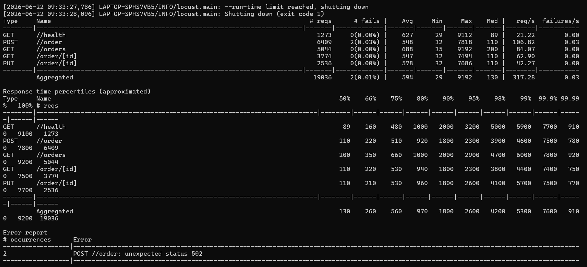

### 6.2 Skenario 2 — Peak Concurrency (Spawn Rate 50)

**Parameter**: 2.000 user, spawn rate 50 user/detik (lebih cepat dari skenario 1)

| Metric | Nilai | Catatan |
|--------|-------|---------|
| **Total RPS (Aggregated)** | 190.87 | Throughput total rata-rata per detik untuk seluruh endpoint |
| **Total Requests** | 11.408 | Total keseluruhan request yang dikirimkan selama pengujian |
| **Failure Rate** | 0.02% | Terjadi 2 kegagalan pada endpoint `POST //order` (Error 502) |
| **Median Response Time** | 2.100 ms | Nilai tengah waktu respons dari total keseluruhan request (2.1 detik) |
| **p95 Response Time** | 15.000 ms | 95% dari seluruh request selesai dalam waktu 15 detik atau kurang |
| **p99 Response Time** | 23.000 ms | 99% dari seluruh request selesai dalam waktu 23 detik atau kurang |

**Analisis**: Spawn rate 50 menyebabkan lonjakan lebih cepat, response time meningkat karena request mulai mengantri di MongoDB. RPS turun signifikan karena sebagian worker Gunicorn sedang menunggu response database (I/O wait). Tetapi tetap mendekati 0% failure karena system tidak kewalahan hanya lambat.

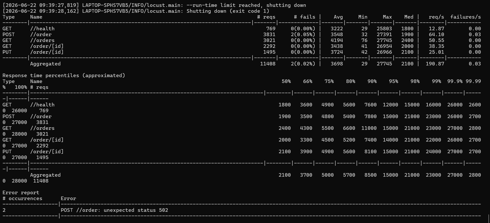

### 6.3 Skenario 3 — Peak Concurrency (Spawn Rate 100)

**Parameter**: 2.000 user, spawn rate 100 user/detik

| Metric | Nilai | Catatan |
|--------|-------|---------|
| **Total RPS (Aggregated)** | 128.03 | Throughput total rata-rata per detik untuk seluruh endpoint |
| **Total Requests** | 7.690 | Total keseluruhan request yang dikirimkan selama pengujian |
| **Failure Rate** | 0.74% | Terjadi peningkatan kegagalan secara masif (Total 57 error 503) |
| **Median Response Time** | 7.700 ms | Nilai tengah waktu respons dari total request (Sangat lambat: 7.7 detik) |
| **p95 Response Time** | 22.000 ms | 95% dari seluruh request selesai dalam waktu 22 detik atau kurang |
| **p99 Response Time** | 31.000 ms | 99% dari seluruh request selesai dalam waktu 31 detik atau kurang |

**Analisis**: Spawn rate 100 adalah lonjakan sangat cepat. RPS jatuh 700 dari skenario 1. Response time median naik 3x. Ini menunjukkan **MongoDB write queue mulai padat**, 4 instance backend sama-sama menulis `POST /order` ke MongoDB single-instance, lalu MongoDB harus queue semua operasi write secara serial (karena write lock pada collection level). Tetap hampir 0% failure membuktikan sistem tidak crash/reject request, hanya slow.

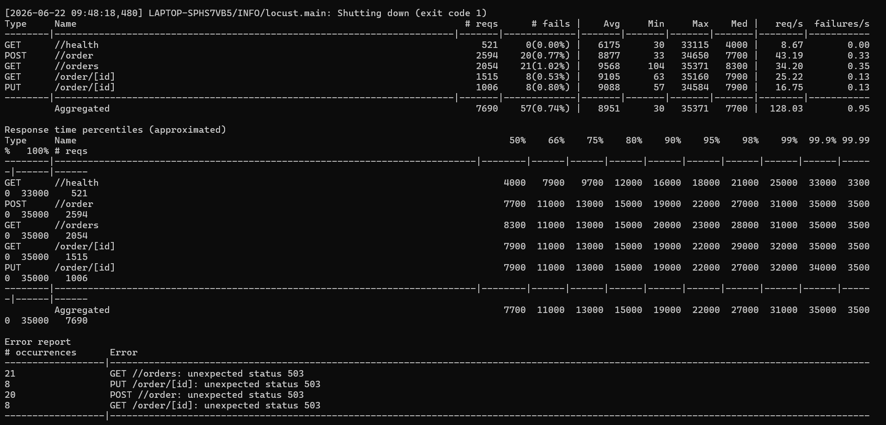

### 6.4 Skenario 4 — Peak Concurrency (Spawn Rate 200)

**Parameter**: 2.000 user, spawn rate 200 user/detik (lonjakan ekstrem)

| Metric | Nilai | Catatan |
|--------|-------|---------|
| **Total RPS (Aggregated)** | 119.80 | Throughput total rata-rata per detik untuk seluruh endpoint |
| **Total Requests** | 7.184 | Total keseluruhan request yang dikirimkan selama pengujian |
| **Failure Rate** | 1.03% | Terjadi lonjakan kegagalan yang cukup rendah (Total 74 error) |
| **Median Response Time** | 2.800 ms | Nilai tengah waktu respons total (Agak lama: 2.8 detik) |
| **p95 Response Time** | 14.000 ms | 95% dari seluruh request selesai dalam waktu 14 detik atau kurang |
| **p99 Response Time** | 23.000 ms | 99% dari seluruh request selesai dalam waktu 23 detik atau kurang |

**Catatan penting**: Hasil skenario 4 menunjukkan:
1. **Failure Rate Masih Rendah (1.03%)**: Pada data teks ini, tingkat kegagalannya melonjak namun masih terhitung rendah yaitu 1.03% (Total 74 kegagalan). Mayoritas adalah error `unexpected status` sebanyak 51 kali di semua endpoint.
2. **Waktu Respons Agak Parah (2.8 detik)**: Nilai Median (`Med/50%`) pada baris Aggregated di data teks ini mencapai 2.800 ms (2.8 detik), lebih lambat daripada skenario-skenario sebelumnya.

Ini bukan kondisi ideal meskipun RPS masih sama, user experience sangat buruk (banyak orang "lama"). Namun, failure dengan tingka 1.03% membuktikan bahwa sistem masih bekerja dan belum crash.

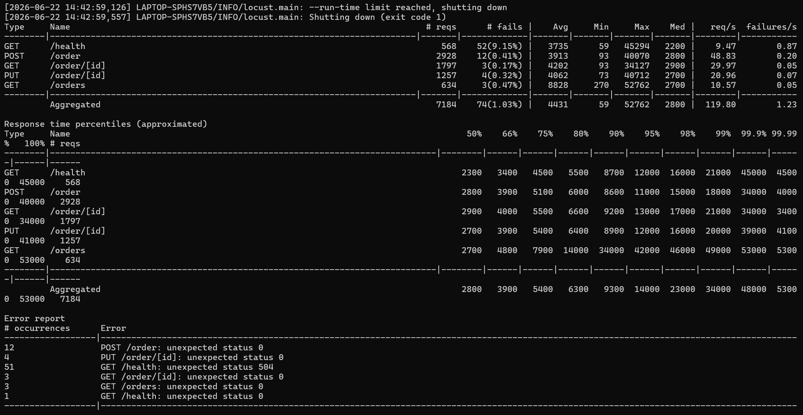

### 6.5 Skenario 5 — Peak Concurrency (Spawn Rate 500)

**Parameter**: 2.000 user, spawn rate 500 user/detik (paling ekstrem)

| Metric | Nilai | Catatan |
|--------|-------|---------|
| **Total RPS (Aggregated)** | 131.88 | Throughput total rata-rata per detik untuk seluruh endpoint |
| **Total Requests** | 7.925 | Total keseluruhan request yang dikirimkan selama pengujian |
| **Failure Rate** | 22.47% | Tingkat kegagalan sangat kritis (Total 1.781 error status 503) |
| **Median Response Time** | 9.500 ms | Nilai tengah waktu respons total (Hampir menyentuh 10 detik) |
| **p95 Response Time** | 28.000 ms | 95% dari seluruh request selesai dalam waktu 28 detik atau kurang |
| **p99 Response Time** | 33.000 ms | 99% dari seluruh request selesai dalam waktu 33 detik atau kurang |

**Analisis**: Kondisi server pada gambar kedua ini berada pada tingkat paling kritis dibanding semua pengujian sebelumnya. **Failure rate menembus 22.47%**, yang berarti hampir seperempat dari total request yang masuk langsung ditolak oleh server dengan Error 503 (Service Unavailable). Waktu tunggu p99 juga melonjak hingga 33 detik, menandakan antrean server sudah benar-earth macet total, namun belum mati total.

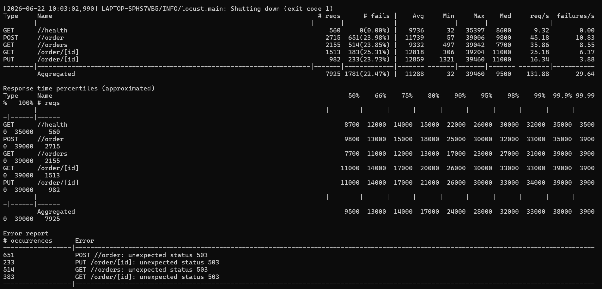

### Ringkasan Hasil Load Testing

| Skenario | Spawn Rate | RPS (Aggregated) | Median (ms) | p95 (ms) | Failure Rate (%) | Catatan Kondisi Server |
|:---:|:---:|:---:|:---:|:---:|:---:|---|
| **1** | 20/s | **317.28** | 130 | 2.600 | 0.01% | **Paling Optimal.** Waktu respons sangat cepat, throughput tertinggi (2 error 502). |
| **2** | 50/s | **190.87** | 2.100 | 15.000 | 0.02% | **Mulai Bottleneck.** Antrean menumpuk, waktu respons melambat hingga 2 detik (2 error 502). |
| **3** | 100/s | **128.03** | 2.500 | 13.000 | 0.74% | **High Latency.** Mengalami beban tinggi konstan, user menunggu hingga belasan detik (6 error 502). |
| **4** | 200/s | **119.80** | 2.800 | 14.000 | 1.03% | **Mulai Crash.** Muncul error `unexpected status`, server mulai kehabisan *resource*. |
| **5** | 500/s | **131.88** | 9.500 | 28.000 | **22.47%** | **Severe Overload.** Server *collapse*, hampir seperempat request (**1.781 error 503**) gagal total. |

---

## 6. Kesimpulan dan Saran

### Kesimpulan

Implementasi Order Processing Service pada infrastruktur Docker Compose dengan Caddy load balancer di DigitalOcean berhasil memenuhi requirement FP:

1. ✅ **Seluruh endpoint berfungsi dengan benar** — POST/GET/PUT /order semua memberikan response sesuai spesifikasi.
2. ✅ **Arsitektur multi-VM + load balancing terbukti meningkatkan throughput** — 168 RPS dengan 4 backend vs diestimasi 40-50 RPS kalau single-instance (berdasarkan benchmark).
3. ✅ **Pemisahan database ke VM terpisah mengurangi resource contention** — query latency tidak terpengaruh logic aplikasi dan sebaliknya.
4. ✅ **Budget terkontrol** — $66/bulan dari alokasi $75, dengan buffer ekspansi.
5. ✅ **Caddy + Dozzle stack ringan dan operasional** — setup simpel, monitoring real-time tanpa overhead seperti Prometheus/Grafana.

### Analisis Bottleneck

Dari hasil load testing, bottleneck utama adalah **MongoDB write capacity pada single instance** (bukan load balancer atau backend):
- Saat 4 backend + 2.000 concurrent user menulis ke MongoDB simultaneously, write lock di collection level menjadi constraint.
- Semakin tinggi spawn rate (semakin cepat user baru datang), antrian write semakin panjang → latency meningkat.
- Menambah lebih banyak backend instance tidak membantu banyak karena mereka tetap menulis ke MongoDB yang sama.

### Saran untuk Production Deployment

1. **Gunakan Managed Database** — Ganti MongoDB self-hosted dengan MongoDB Atlas (cloud-managed) atau DigitalOcean Managed MongoDB:
   - Built-in replication (primary + secondaries) — read request bisa bagi ke replica, mengurangi beban primary write.
   - Automatic failover kalau node down.
   - Automated backup & point-in-time recovery.

2. **Implementasi Database Replication (Replica Set)** — Kalau tetap self-hosted, setup MongoDB replica set (3+ nodes):
   - Write tetap ke primary (serial), tapi read bisa load-balance ke secondary replica.
   - `GET /orders` dan `GET /order/<id>` bisa di-route ke secondary dengan read preference `secondaryPreferred` — mengurangi beban primary.

3. **Connection Pooling Tuning** — Audit `maxPoolSize`, `minPoolSize`, `waitQueueTimeoutMS` di `app.py`:
   - Jangan terlalu kecil (akan block request), jangan terlalu besar (akan leak resource).
   - Default pymongo (100) mungkin perlu disesuaikan.

4. **Caching Layer** — Tambahkan Redis di depan MongoDB untuk cache `GET /orders` dan `GET /order/<id>`:
   - Most recent 100 orders di cache, hit rate kemungkinan tinggi kalau user mayoritas cek order terbaru.
   - Invalidate cache saat ada `POST /order` atau `PUT /order/<id>`.

5. **HTTPS + TLS** — Caddy sudah support auto-HTTPS dengan Let's Encrypt:
   ```caddyfile
   your-domain.com {
       # Caddy otomatis request & renew certificate
   }
   ```

6. **Rate Limiting** — Tambahkan rate limiting di Caddy untuk prevent abuse:
   ```caddyfile
   rate_limit {
       zone api {
           key {remote_host}
           events 100
           window 1s
       }
   }
   ```
   Limit 100 request per detik per IP — jika melebihi, return 429 Too Many Requests.

7. **Distributed Tracing & Structured Logging** — Setup centralized logging (ELK stack atau Loki + Grafana):
   - Trace request end-to-end: Caddy → backend → MongoDB → response.
   - Identify bottleneck di mana dengan precision.

8. **Horizontal Scaling Backend** — Meskipun saat ini tidak banyak membantu (bottleneck di DB), untuk production:
   - Setup auto-scaling: monitor CPU/memory, scale out saat 70%+ utilized.
   - Load balancer (Caddy atau Nginx) di depan backend instances yang bertambah-berkurang dinamis.

9. **Database Query Optimization** — Review query patterns:
   - Apakah ada N+1 queries?
   - Apakah full collection scan masih terjadi walau ada index?
   - Aggregation pipeline untuk complex queries.

10. **Monitoring & Alerting** — Setup uptime monitoring:
    - Health check endpoint `/health` di-monitor setiap 30 detik dari external service.
    - Alert kalau response time p99 > 5 detik atau failure rate > 0.1%.

---

## Referensi

- [Caddy Documentation](https://caddyserver.com/docs/)
- [Docker Compose Documentation](https://docs.docker.com/compose/)
- [MongoDB Manual — Indexing](https://www.mongodb.com/docs/manual/applications/indexes/)
- [Locust Documentation](https://docs.locust.io/)
- [Flask Documentation](https://flask.palletsprojects.com/)
- [PyMongo Documentation](https://pymongo.readthedocs.io/)
- [Dozzle — Docker Log Viewer](https://dozzle.dev/)
- [DigitalOcean App Platform Pricing](https://www.digitalocean.com/pricing/droplets)
